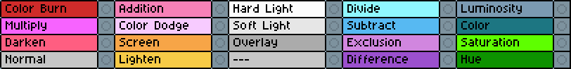
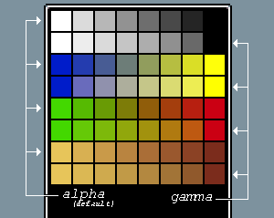

# Shurushki

A collection of badly maintained scripts for Aseprite with no unified purpose.

## Installation
1. Download this repo as a .zip using the "Code" button above. 
1. Change the extension from .zip to .aseprite-extension.
1. Double click it to install. 
1. Alternatively, in Aseprite, got to "Edit > Preferences > Extensions > Add Extension" and select the saved file.
1. Might need to restart Aseprite for menu options to appear.

## Settings

To keep the UI uncluttered, unneeded features can be disabled via `Help > Shuruski` (it also opens on first launch after the installation).

If something goes wrong, it might help to delete `__pref.lua` file in the installation folder. It can be found by going to "Edit > Preferences > Extensions", picking **this** extension and clicking "Open Folder" nearby. If that doesn't work, look inside [settings folder](https://www.aseprite.org/docs/preferences-folder/) (on windows, type `%APPDATA%\aseprite\extensions\shurushki` in the explorer's address bar).

## Scripts

### Bitmap Text (`Edit > Bitmap Text`)

Draw bitmap text using a simple bmf format used in ProMotion/GrafX2/Love2D/etc. Not to be confused with Angelcode's bmfont. An example of such font (by me) is included. Unlike ttf's, these fonts never blur, support color, and are pretty trivial to edit.

### Circular Shift (`Timeline > Cel > Right Click`)

Moves the selected cels N frames in curcular fashion. For instance, shifting cels for frames {2,3,4,5} by +1 reorders them to {5,2,3,4} in the same place. Optionally, it might apply to timings as well (affects all layers, naturally). I do that quite often to desynchronise the looping parts of the animation, or fix walk-cycle-to-idle snap.

### Draw Grid (`Edit > Draw Grid`)

Generate a grid. Supports isometric, triangular, square and diamond grids.

### Export Atlas (`File > Export Atlas`)

Combine multiple sprites to a single texture and generates .json data for the layout. Similar to spritesheet export, but can combine multiple sprites, and each layer and frame is treated separately.
**Requires** Python 3.x to be installed, along with `rectpack` package (can be installed as `python -m pip install rectpack`)

### Splice animation (`File > Splice Animation`)

Export an animation by joining tags or frames several times.

### Highlight Cels (`View > Highlight Cels`)

Makes Timeline a bit easier to navigate by finding and highlighting frames of certain duration. Also allows to highlight cels manually, even though Aseprite now added its own tools for doing so.

### Highlight Layers (`View > Highlight Layers`)

Highlights layers that use blending modes. Only applies to current/selected layers. You'll probably want to edit the code to change the colors - mind that ase uses 0xAABBGGRR layout for colors, so e.g 0xff0044aa becomes opaque brown

### Ramp From Selection (`Color Bar > Options > Ramp From Selection`)

Adds all colors used inside of the selection to the palette, sorted by value. Same could be done with the colorpicker and "Add color to the palette" command (which needs to be assigned to a key to use) but faster and less chance to miss a color.

### Link Active Cel / Link To All Frames (`Timeline > Cel > Right Click`)

Make the current cel linked to either the selection, or the whole timeline. Unlike the default commands, all new cels store the same frame as the current cel, not the first one. Makes working with multiple layers for the background in an animation a bit faster.

### Open In GrafX2 (`Layer > Open in GrafX2`)

Opens the current layer (clipped to the sprite border) in grafx2 and patches it back when it's closed. Everything beyond the sprite border will be lost. Only works on Windows, and you need to change the path to the grafx2 executable in the beginning of the script file for it to work properly.

### Pattern Select (`Select > Frame Pattern`)

Select frames in a checkered order. Primary use is for dropping the frames from gifs to reduce the size (in that case, don't forget to adjust the framerate afterwards!).

### Time Stretch (`Frame > Time Stretch`)

Speed up/slow down the animation proportionally by scaling frame durations, or adding/removing a constant amount of time to them.

### Move Cels (`Edit > Move Cels`)

Move cels with a formula based on their frame time or frame number. Makes working with movement animations a little easier. 
*Example: setting `x=6 * t` will move the sprite with the speed of 6 pixels per frame. After that, calling with `x=-6 * t` does the same but to the left, thus returns the sprite to marching at place.*

### Cels To Layers (`Timeline > Cel > Right Click`)

Move each selected cel into a new separate layer. It helps, for instance, to merge several frames into one; or to open png sequence as layers. Overall, it's a weird feature that mostly satisfies author's personal preferences.

### Gamma Gradient (`Color Bar > Options > Gamma Gradient`)

Generates a gradient ramp from selected colors using the equation for overlapping light.

*Note: at the moment of writing, there's no option to put it into "Sort and Gradients" menu. It works differently from the rest of the UI, and seems to inaccesibble to plugins🤷*

## Shortcuts

Shortcuts have to be assigned in the shortcuts menu (`Edit > Keyboard Shortcuts` or `Shift + Ctrl + Alt + K`).

### Common %shape% Brush; Common %change% Size; Common %change% Opacity

Change the brush parameters. Some of this functionality is already available as ase commands, but unlike those, these shortcuts apply to every tool at once. It's an opinionated change, but the author personally *never, not even once,* remebered which settings the tool has, resulting in unnerving surprizes. To make things worse, ase does share the color among the tools, while the brush shape and size are independent.

### Certain Fill; Certain Replace Color

Switches to the Fill tool with contiguous switch on or off. Also opinionated, but from artistic point of view, these two techniques produce vastly different results. It's more convenient to make them separate, forgetting the word "contiguous". Look how they got different names for what they do, not how they work.

### Certain Select Color; Certain Select Cluster

Switches to the Magic Wand tool with contiguous switch on or off. Same exact reasoning applies as for fill/replace color.

### Background Zero

Set background color to transparent black

### No Overlay Brightness/Contrast|Hue/Saturation|Color Curve

Same usual color adjustments, but it hides the selection/onionskins/grid during the adjustment. This doesn't replace edit menu items!! But can be assigned to the shortcuts the default transforms had.